<picture>
  <source media="(prefers-color-scheme: dark)" srcset="dark.svg">
  <source media="(prefers-color-scheme: light)" srcset="light.svg">
  
</picture>

 

### 🛠 Tech Stack

 

### 🚀 Featured Projects

| Project | Description | Stack |
|---|---|---|
| **[Stock Prediction App](https://github.com/Krishna-Gupta989/Stock-PredictorApp)** | Time-series forecasting of NYSE stock prices using GRU/LSTM, deployed as an interactive Streamlit app | `Python` `GRU/LSTM` `Streamlit` |
| **[Retail Sales Forecasting](https://github.com/Krishna-Gupta989/RetailSales-Forecasting)** | Led feature engineering + model comparison (Linear, Lasso, Ridge, Decision Tree); best results with tuned Ridge | `Scikit-learn` `Pandas` |
| **[Breast Cancer Prediction](https://github.com/Krishna-Gupta989/Breast-Cancer-Prediction)** | 95%+ accuracy on the Wisconsin dataset using Logistic Regression, validated via ROC-AUC | `Scikit-learn` `Seaborn` |
| **[Real-Time Face Detection](https://github.com/Krishna-Gupta989/Real-Time-Face-Detection)** | Real-time face localization on live webcam input using optimized Haar Cascade classifiers | `Python` `OpenCV` `NumPy` |

 

### 📊 GitHub Stats

  
  

  

 

### 🌱 Currently Learning
LLM / GenAI workflows via Hugging Face — extending applied ML into experimental NLP + generative pipelines.

💬 **Ask me about:** Computer Vision, NLP, Time-Series Forecasting, PyTorch/TensorFlow

⚡ **Fun Fact:** Published an ML paper at ICCT 2025 on detecting fake product reviews — 91% accuracy.

 

### 🌐 Connect with me

